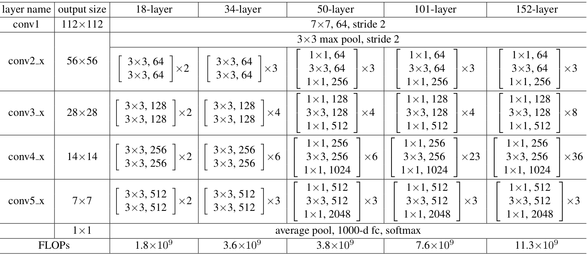

# Face_detection
Comparing face detection performance with DTCNN, dlib, Haar Cascades and DNN OpenCV  
　  

# Reference  
[Face Detection Models: Which to Use and Why?
](https://towardsdatascience.com/face-detection-models-which-to-use-and-why-d263e82c302c)  
[Wider Face Dataset](http://shuoyang1213.me/WIDERFACE/)

## [Haar cascade]  
- [Haar CasCade and Using CNN to Make 15 Landmarks](https://www.youtube.com/watch?v=vC3bTziLRTA)
- 
## [dlib]  
- [dlib code](https://github.com/1adrianb/face-alignment)
- [dlib explain](https://medium.com/@jongdae.lim/%EA%B8%B0%EA%B3%84-%ED%95%99%EC%8A%B5-machine-learning-%EC%9D%80-%EC%A6%90%EA%B2%81%EB%8B%A4-part-4-63ed781eee3c)
- [dlib public web site](https://github.com/davisking/dlib)
- [Face landmark dlib with NN]
## [Multi-task Cascaded Convolutional Nerual Network(MTCNN)]  
- [68 Facial Landmark ](https://github.com/nicehuster/pytorch-facial-landmark)
- 
## [OpenCV's DNN Module]

## Training Landmark model
I will use ResNet50 model to detect facial keypoints. It has many pre-trained model and results. So I will compare between my learning model and pre-trained model. 
　  
### ResNet50 Layers
It is based on the residual block. Corresponds to the 50th layer section in the figure below.

https://deep-learning-study.tistory.com/534
https://mole-starseeker.tistory.com/12
https://deep-learning-study.tistory.com/534
https://jisuhan.tistory.com/entry/CNN-ResNet50-%ED%86%BA%EC%95%84%EB%B3%B4%EA%B8%B0-%EA%B5%AC%EC%A1%B0%EC%99%80-%EC%BD%94%EB%93%9C-%EB%B6%84%EC%84%9D

## Appendix
- [caffe library explain in Korean](http://blog.naver.com/PostView.nhn?blogId=laonple&logNo=221356704783&categoryNo=0&parentCategoryNo=0&viewDate=&currentPage=1&postListTopCurrentPage=1&from=postView)
- [Caffe Website](https://caffe.berkeleyvision.org/)
- [Initial image classification technique RCNN](https://ganghee-lee.tistory.com/35)
- [Initial image classification technique Fast RCNN](https://ganghee-lee.tistory.com/36)
- [Initial image classification technique Faster RCNN](https://ganghee-lee.tistory.com/37)
- [Compare code](https://www.kaggle.com/timesler/comparison-of-face-detection-packages)

